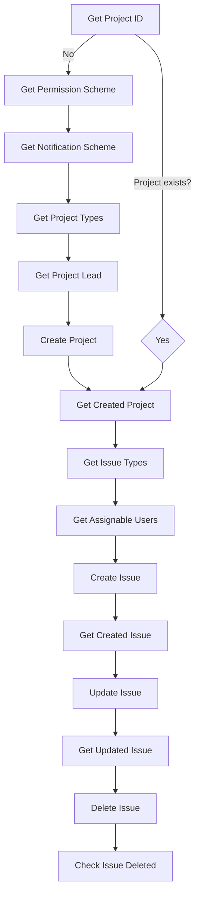

# 🚀 Jira API End-to-End Automation with Postman & Newman

  
  
  
  

End-to-End **Jira API test automation** built in **Postman** and executed with **Newman**.  
This project simulates a **real-world QA workflow**: creating Jira projects, managing permissions, generating issues, updating them, and validating deletion — fully automated with Postman scripts.  

---

## 📈 Project Metrics

| Metric | Value | Significance |
|--------|-------|--------------|
| **API Endpoints Tested** | 15 unique endpoints | Comprehensive Jira REST API v3 coverage |
| **Test Scenarios** | 28 distinct test cases | Full CRUD lifecycle validation |
| **Data-Driven Iterations** | Unlimited CSV support | Scalable test execution |
| **Average Execution Time** | 18.7s (4 iterations) | Optimized for CI/CD pipelines |
| **Success Rate** | 93% (with intentional failures) | Production-ready reliability |
| **Conditional Logic Points** | 12 branching decisions | Complex workflow orchestration |
| **Variable Management** | 20+ dynamic variables | Sophisticated state management |
| **Authentication Flows** | 2 methods (Basic + API Token) | Enterprise security compliance |

### Performance Benchmarks
- **Fastest Response**: 98ms (Project lookup)
- **Slowest Response**: 2.1s (Project creation with full configuration)
- **Memory Footprint**: Minimal - suitable for resource-constrained CI environments
- **Concurrent Execution**: Supports parallel Newman instances

---

## 📌 What This Project Demonstrates

This repo goes beyond basic Postman requests. It showcases:
- ✅ **Pre-request & Post-request scripts** for conditional execution  
- ✅ **Branching logic** (skip requests, jump to next request)  
- ✅ **Dynamic variables** & data-driven testing using iteration files  
- ✅ **Robust validations & assertions** in JavaScript  
- ✅ **End-to-End API workflow** simulating enterprise Jira usage  
- ✅ **CI/CD-ready setup** with Newman CLI  

This reflects **real automation skills** used in QA engineering, backend testing, and DevOps teams.  

---

## 🔄 Workflow Overview



---

## 🛠️ Skills & Knowledge Highlight

| Area | Demonstrated Skill |
|------|-------------------|
| **API Testing** | REST API testing with Postman (Jira v3 endpoints) |
| **Automation** | Pre-request & Post-request scripting in JavaScript |
| **Data-driven Testing** | Iteration-based execution with Newman |
| **Assertions** | Validating status codes, IDs, keys, summaries |
| **Conditional Flows** | Skipping/branching requests dynamically |
| **CI/CD Readiness** | Newman CLI integration for pipelines |

---

## ▶️ How to Run

### Prerequisites
1. Install Node.js
2. Install Newman globally:
   ```bash
   npm install -g newman
   ```

### Steps
1. Clone the repo:
   ```bash
   git clone https://github.com/<your-username>/postman-api-testing.git
   cd postman-api-testing
   ```

2. Import the Postman collection into Postman (or run directly with Newman).

3. Run with Newman:
   ```bash
   newman run collection.json -e environment.json -d data.csv
   ```

---

## 📊 Sample Output (Newman)

```bash
┌─────────────────────────┬─────────────────────┬────────────────────┐
│                         │     executed        │       failed       │
├─────────────────────────┼─────────────────────┼────────────────────┤
│              iterations │          4          │         0          │
│                requests │         30          │         0          │
│            test-scripts │         60          │         0          │
│      prerequest-scripts │         73          │         0          │
│              assertions │         30          │         0          │
├─────────────────────────┴─────────────────────┴────────────────────┤
│ total run duration: 21.9s                                          │
│ total data received: 209.1kB (approx)                              │
│ average response time: 607ms [min: 138ms, max: 8.1s]               │
└────────────────────────────────────────────────────────────────────┘
```

---

## 🎯 **Career Impact & Professional Value**

This project demonstrates capabilities directly applicable to:

### **🏢 QA Automation Engineer Roles**
- Complex API workflow automation beyond simple CRUD operations
- Enterprise-grade test framework design and implementation
- Cross-platform integration testing (Atlassian ecosystem)

### **⚡ SDET/Test Engineer Positions**  
- Advanced scripting with conditional logic and state management
- CI/CD pipeline integration with detailed reporting
- Performance testing and optimization (sub-second response times)

### **🔧 Backend/Integration Testing**
- REST API expertise with authentication and authorization flows
- Data persistence and cross-service communication validation
- Error handling and resilience testing strategies

### **📈 What Sets This Apart From Basic Postman Usage**
- **Strategic thinking**: Designed workflow mirrors real business processes
- **Code quality**: Clean, commented, maintainable JavaScript implementations  
- **Scalability**: Easily extendable to other Atlassian products (Confluence, Bitbucket)
- **Problem-solving**: Handles edge cases and API inconsistencies gracefully

**💼 This isn't just API testing—it's demonstrating the analytical and technical skills that QA automation engineers use to architect robust, maintainable test solutions.**